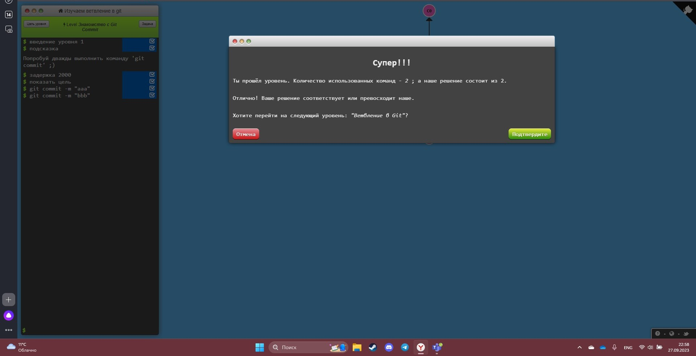
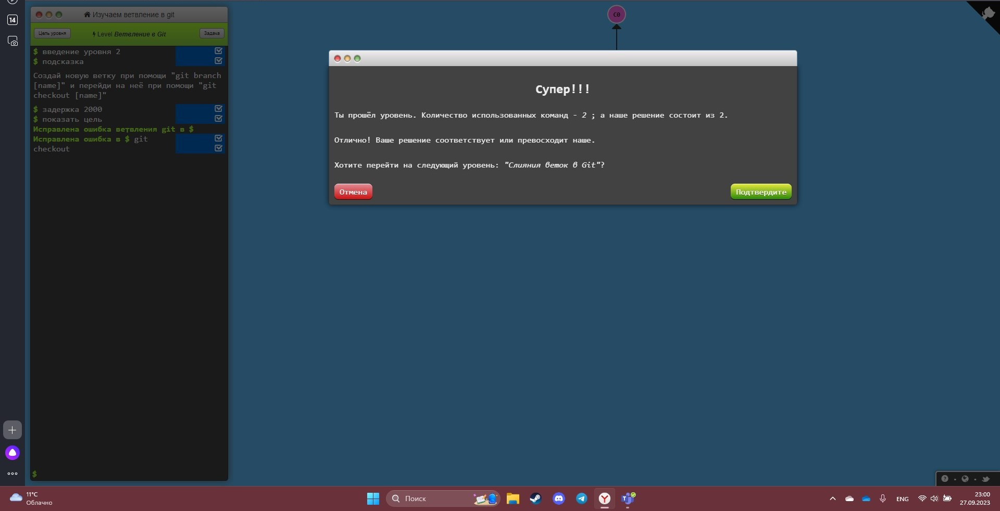
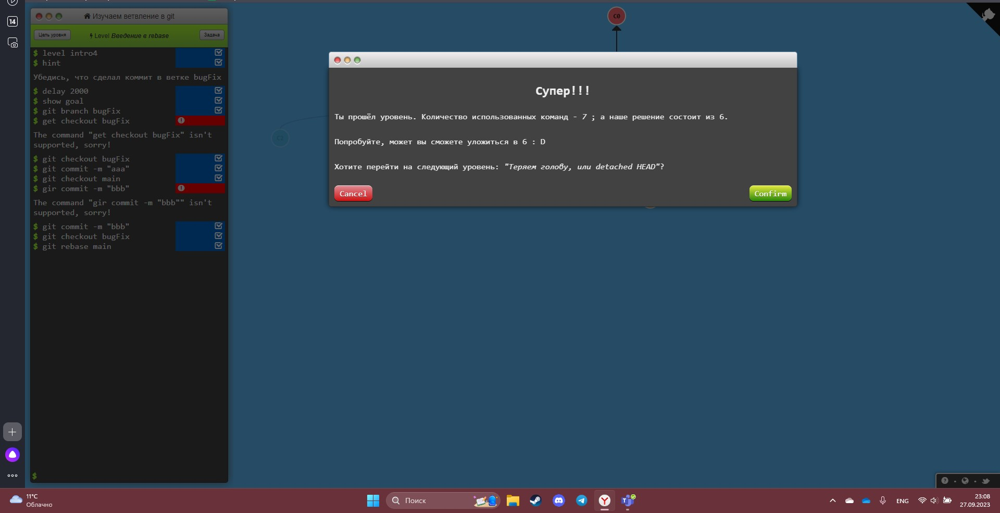

# -1
# Исполнитель:
***Мужева Елизавета Игоревна***
# Краткое описание программы
Программа 1 - ввод двух чисел с клавиатуры и вывод их суммы, разности, ср. арифм и частного на экран
Программа 2 - ввод информации про программиста и вывод текста на экран
# Описание того, в какой среде программирования можно открыть проект, какой файл проекта следует открывать, каким образом запускать вашу программу, и как ей пользоваться
Проект можно открыть в Visual Studio Code, как файл проекта lub1, так и lub2
# Скриншоты тестов

